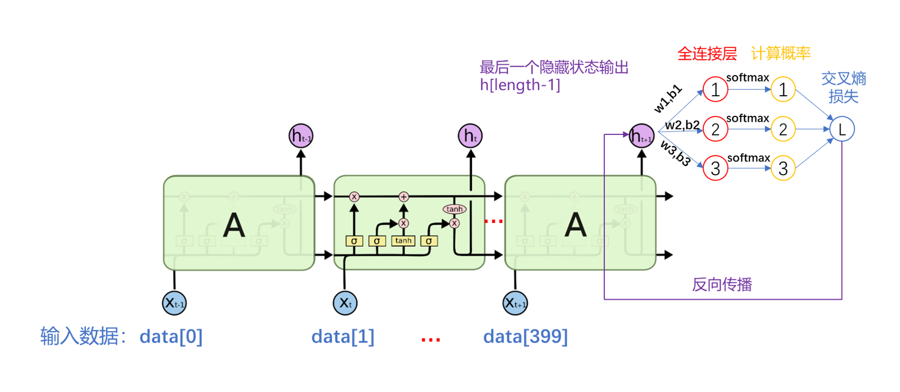

# C-LSTM-Classification
A C language implementation of an LSTM model for a three-class classification task.
# C 语言实现 LSTM 算法三分类任务

## 一、LSTM的计算过程

作为机器学习算法的一种，LSTM 的应用包括利用大量数据进行训练和根据训练得到的参数预测两个步骤。其预测过程使用正向传播算法，训练过程采用误差反向传播算法。

## 二、代码使用方法

### **1.环境准备**

1.  确保系统中已经安装了 C 语言的编译器，如 GCC

2.  验证 `lstmlib.h` 和 `lstmlib.c` 已经正确地放置在同一个项目目录下，并且已经正确配置

3.  打开编译器或命令提示符，导航到`main.c`    包含文件的目录

### 2.数据准备

#### 2.1数据格式转换xls->csv

由于c语言只能读取csv文件，因此使用python对数据进行预处理，批量转换xls文件转换为csv文件

打开xls2csv.py文件，将`folder_path`的路径改为包含类别数据文件1.xls,2.xls,…,n.xls的目录，运行xls2csv.py文件，按此方法分别完成三个类别数据格式的转换

#### 2.2训练数据（如果需要重新训练模型）

确保将三类数据分别放置在class\_1,class\_2,class\_3文件夹下，且数据文件命名为1.csv,2.csv,…100.csv,…n.csv

#### 2.3测试/预测数据

确保将三类数据分别放置在class\_1,class\_2,class\_3文件夹下，且数据文件命名为1.csv,2.csv,…100.csv,…n.csv

### 3.数据文件路径准备

检查程序中用于加载和保存数据的所有文件路径，确保它们指向正确的文件位置。这包括训练数据和测试数据的CSV文件路径，以及模型保存和加载时的文件路径

#### **3.1训练数据文件路径**

*   用于加载训练数据的路径由变量 `file_name` 动态构建，格式如下：

    snprintf(file\_name, sizeof(file\_name), `"your/path/Train/class_%d/%d.csv"`, class\_id, sample\_id);

*   这里 `class_id` 和 `sample_id` 是循环变量，用于指定不同类别和样本编号的数据文件。

#### **3.2模型保存文件路径**

*   保存训练后的LSTM模型的文件路径为：char \*file\_train = `"your/path/Train/train.txt"`;

*   这个路径在保存模型参数时使用

#### **3.3损失数据文件路径**

*   损失数据被写入的文件路径定义如下：char \*file\_loss = `"your/path/Train/loss_data.csv"`;

*   这个文件用于记录每个训练周期的损失，帮助监控训练进度。

#### **3.4测试/预测数据文件路径**

*   测试模型时使用的数据文件路径由变量 `file_name` 动态构建，格式如下：

    snprintf(file\_name, sizeof(file\_name), `"your/path/Test/class_%d/%d.csv"`, class\_id, sample\_id);

*   同样，这里的 

    `class_id` 和 `sample_id` 用于从不同的测试类别和样本编号加载数据。

#### 3.5示例初始代码文件路径

*   训练数据文件：

    `"your/path/Train/class_%d/%d.csv"`

*   模型保存文件：

    `"your/path/Train/train.txt"`

*   损失数据文件：

    `"your/path/Train/loss_data.csv"`

*   测试数据文件：

    `"your/path/Test/class_%d/%d.csv"`

#### 3.6宏定义参数

*   `NUM_CLASSES`：分类个数 默认3

*    `NUM_SAMPLES_PER_CLASS`：每个类别的训练样本个数  默认100（笔者训练时采用，根据需要修改即可）
  
*    `DATA_LENGTH`：时间序列数据长度 默认400

*    `NUM_EPOCHS`：训练次数   默认50（笔者训练时采用，根据需要修改即可）

*    `IF_TRAIN`：训练模式，IF_TRAIN=1 训练模型；IF_TRAIN=0 测试模型

*    `NUM_SAMPLES_PER_CLASS_TEST`：每个类别的预测样本个数 默认20（笔者训练时采用，根据需要修改即可）

## 4.代码运行

### **4.1模型训练和测试**

*   运行程序前，检查

    `main.c`中的宏定义设置（如 `IF_TRAIN`），以确定是进行训练还是测试。

*   如果进行训练（`IF_TRAIN = 1`），程序会从指定的训练数据路径读取数据，训练 LSTM 网络，并将模型参数保存到指定的文件

*   如果进行测试/**预测** （`IF_TRAIN = 0`），确保已有训练好的模型文件，程序会加载这个模型并使用测试数据进行预测，评估模型性能

## 三、函数说明

### 1. struct lstmlib\* lstmlib\_create(int length)；

#### 参数

1.  length:LSTM接受输入序列的长度

#### 返回值

返回一个 struct lstmlib\* 结构体指针，或者失败时返回 `NULL`

#### 功能

*   创建并初始化一个

    `LSTM`单元，并返回一个结构体指针，可以对这个结构体指针使用 lstmlib 其他函数进行操作

*   动态分配内存给网络的各个参数，包括输入、隐藏状态、各个门的参数等

*   lstmlib\_create 方法会自动调用 lstmlib\_random\_params 对参数进行初始化赋值，赋值的范围是\[-1,1]

*   如果任何内存分配失败，函数会逐步释放已分配的内存并返回 `NULL`

### 2. char lstmlib\_random\_params(struct lstmlib \*unit, double min, double max);

#### 参数

1.  unit :一个 LSTM 单元结构体指针
2.  min :最小值
3.  max :最大值

#### 返回值

成功返回1，失败返回0

#### 功能

对指定的 LSTM 单元的参数进行随机初始化，初始化的范围是\[min，max]

### 3. char lstmlib\_run\_unit(struct lstmlib \*unit, int \*target\_labels)；

#### 参数

1.  unit :一个 LSTM 单元结构体指针
2.  target\_labels :目标类别标签指针

#### 返回值

执行成功返回1，失败返回0

#### 功能

*   执行LSTM单元的前向传播过程
*   计算每个时间步的遗忘门、输入门、输出门、记忆细胞和隐藏状态
*   计算输出层的softmax输出，用于分类任务

### 4. char lstmlib\_fit\_unit(struct lstmlib \*unit, double lr, int \*target\_labels);

#### 参数

1.  unit :一个 LSTM 单元结构体指针
2.  1r :浮点数，学习率
3.  target\_labels :目标类别标签指针

#### 返回值

执行成功返回1，失败返回0

#### 功能

*   执行LSTM单元的后向传播（反向传播）过程，更新网络参数
*   使用梯度下降算法调整权重和偏置，以最小化损失函数

### 5. int lstmlib\_save(struct lstmlib \*unit, char \*file\_name);

#### 参数

1.  unit :一个 LSTM 单元结构体指针
2.  file\_name :文件名

#### 返回值

返回写入文件的总字节数

#### 功能

*   将LSTM网络的参数保存到指定的文件中
*   包括写入网络的长度、各个权重和偏置参数

### 6. struct lstmlib\* lstmlib\_load(struct lstmlib \*unit, char \*file\_name);

#### **参数**

1.  **unit**

     : 指向LSTM单元结构体的指针

2.  **file_name**

     : 要加载的文件名称

#### **返回值**

成功加载返回指向LSTM单元的指针，失败返回NULL

#### **功能**

*   从指定文件中加载LSTM网络的参数
*   读取并设置网络长度、各种权重和偏置等参数

### 7. int load_csv_data(const char *file_name, double *data, int length);**

#### **参数**

1.  **file_name**

     : CSV文件的路径

2.  **data**

     : 用于存储加载数据的数组

3.  **length**

     : 预期加载数据的数量

#### **返回值**

成功加载返回1，失败返回0

#### **功能**

*   从CSV文件中按行读取数据，加载到指定的数组中
*   主要用于加载时间序列或其他形式的训练数据

### 8. void one_hot_encode(int class_id, int num_classes, int *encoded_label);*

#### **参数**

1.  **class_id**

     : 类别的标识符（通常是从1开始的索引）

2.  **num_classes**

     : 总类别数

3.  **encoded_label**

     : 存储生成的one-hot编码数组

#### **返回值**

无返回值

#### **功能**

*   将类别标识符转换为one-hot编码格式
*   主要用于将分类标签转换成神经网络可以处理的形式

### 9. void shuffle_samples(Sample *samples, int n);*

#### **参数**

1.  **samples** : 指向样本数组的指针。

2.  **n** : 样本数组中的元素数量。

#### **返回值**

无返回值

#### **功能**

*   随机打乱样本数组的顺序
*   主要用于在训练神经网络前增加数据的随机性，帮助提高模型的泛化能力

## 四、网络结构展示

## Acknowledgements

This project uses code from the following open-source packages:

- [C-LSTM] by 庵中十三居士 (az13js), available under the MIT License. See [C-LSTM](https://github.com/az13js-org/C-LSTM) for more details.
